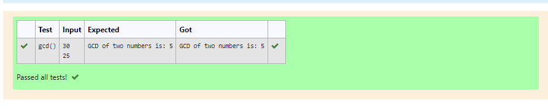

# Find the GCD of two numbers

## AIM:
To write a program to find the GCD of two numbers using function.

## Equipments Required:
1. Hardware – PCs
2. Anaconda – Python 3.7 Installation / Moodle-Code Runner

## Algorithm
1.Get the input from the user.
2.Use exponential operator to find the expoential of a number.
3.Print the output.
4.End the programme.
## Program:
```
def gcd():
    n1,n2=int(input()),int(input())
    if n1>n2:
        smaller=n2
    else:
        smaller=n1
    for i in range(1,smaller+1):
        if(n1%i==0 and n2%i==0):
            hcf=i
    print("GCD of two numbers is:",hcf)
/*
Program to find the gcd of two number using function.
Developed by: 21004872
RegisterNumber: V.Navya 
*/
```

## Output:



## Result:
Thus the program to find the GCD of two numbers is written and verified using python programming.
